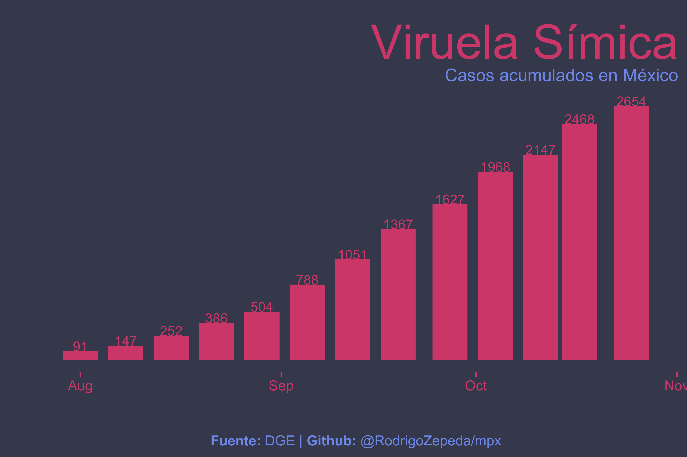

# MPX

Implements a pair formation model adapted from [Betti _et al_](https://doi.org/10.1101/2022.08.17.22278897) for modeling Monkeypox and Monkeypox vaccination in Mexico. 

> For more information on pair formation models for sexually transmitted infections see [Kretzschmar and Heijne](https://doi.org/10.1016/j.idm.2017.07.002)

## Data

Data is downloaded periodically from [Our World in Data](https://ourworldindata.org/monkeypox) which in turn results from an update from the World Health Organization. 

## Model

See additional information for model. 

## References

1. Edouard Mathieu, Fiona Spooner, Saloni Dattani, Hannah Ritchie and Max Roser (2022) - "Monkeypox". Published online at OurWorldInData.org. Retrieved from: 'https://ourworldindata.org/monkeypox' [Online Resource]

2. Kretzschmar, Mirjam, and Janneke CM Heijne. "Pair formation models for sexually transmitted infections: a primer." Infectious Disease Modelling 2.3 (2017): 368-378.

3. Betti, Matthew, Lauren Farrell, and Jane M. Heffernan. "A pair formation model with recovery: Application to monkeypox." medRxiv (2022).